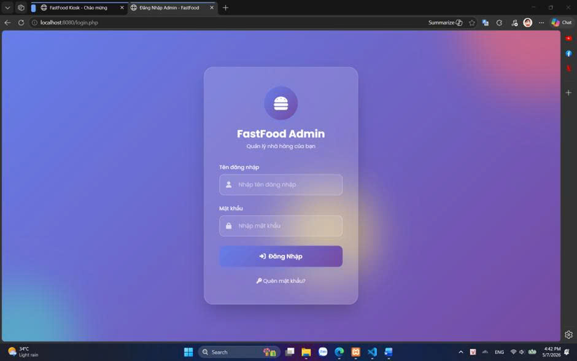
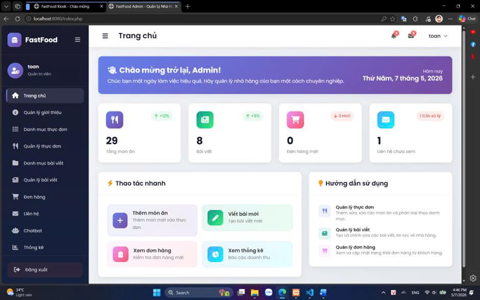
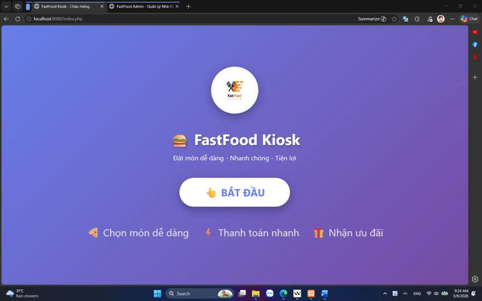
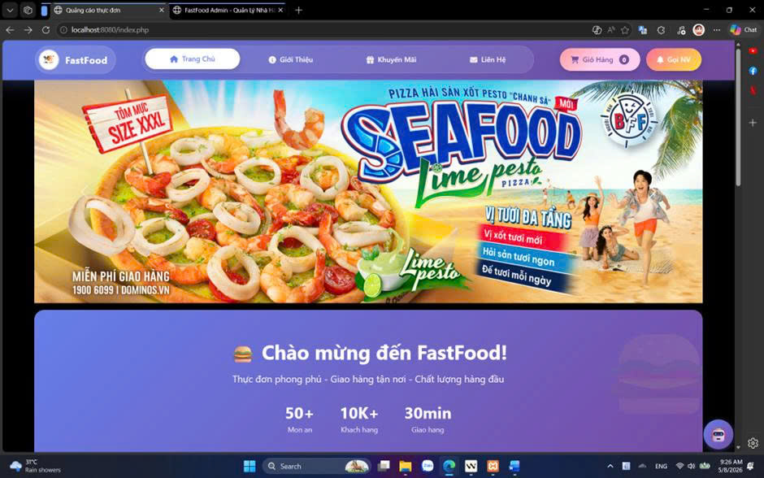
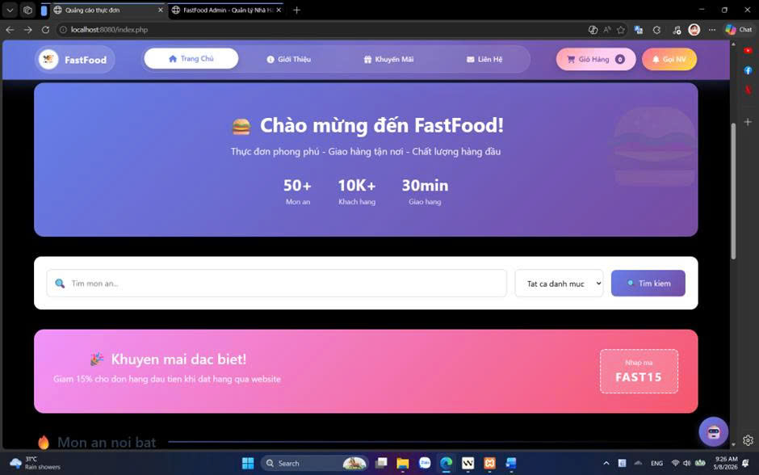
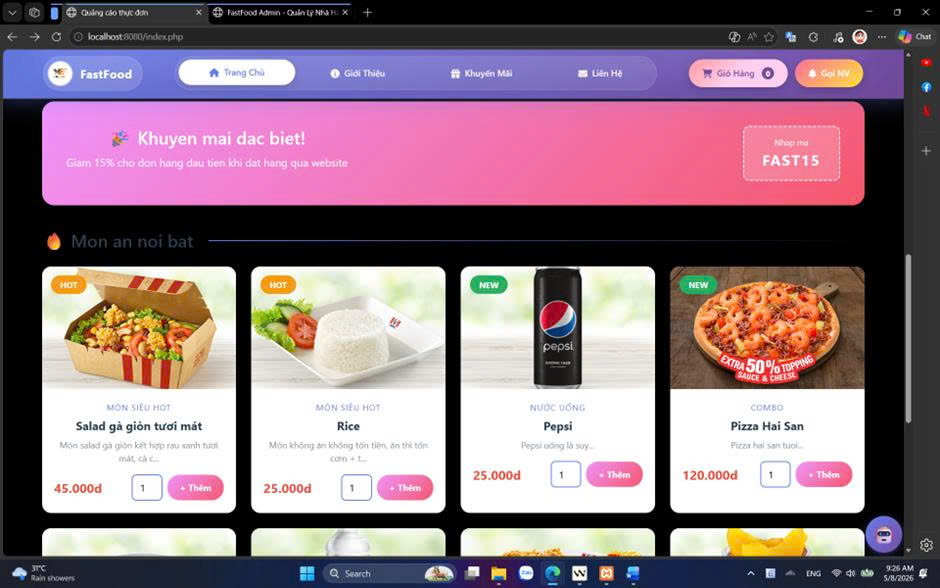
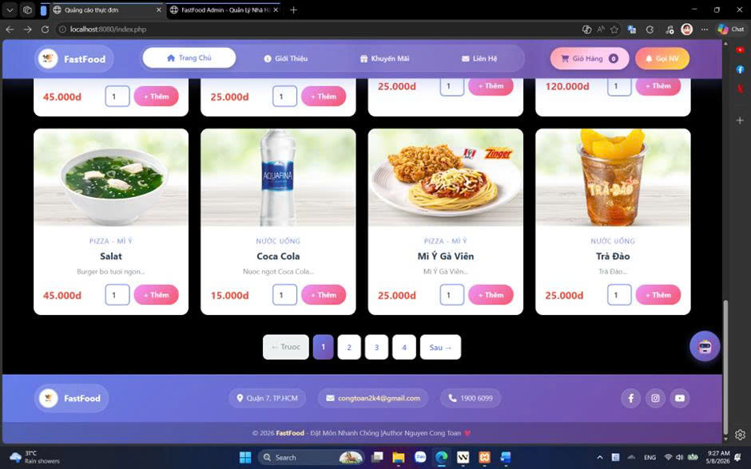

# 🍔 FastFood Kiosk - Hệ Thống Gọi Món Tự Động + AI Chatbot 

<p align="center">
  
  
  
  
</p>

> 🎯 **Mô phỏng trải nghiệm gọi món tự động** tương tự máy order trong cửa hàng McDonald's  
> 🤖 **Chatbot AI thông minh** hỗ trợ khách hàng 24/7 - Trả lời tự động về thực đơn, giá cả, khuyến mãi!

---

## 📋 Mục Lục

- [🧠 Tổng Quan Hệ Thống](#-tổng-quan-hệ-thống)
- [🔄 Luồng Hoạt Động](#-luồng-hoạt-động)
- [📁 Cấu Trúc Dự Án](#-cấu-trúc-dự-án)
- [⚙️ CÀI ĐẶT & CHẠY HỆ THỐNG](#️-cài-đặt--chạy-hệ-thống)
  - [📦 Bước 1: Clone Project](#-bước-1-clone-hoặc-giải-nén-project)
  - [🗄️ Bước 2: Import Database](#️-bước-2-import-database)
  - [⚙️ Bước 3: Cấu Hình Database](#️-bước-3-cấu-hình-kết-nối-database)
  - [🖥️ CÁCH CHẠY 2 TRANG](#️-cách-chạy-2-trang-admin--customer)
- [🤖 TÍNH NĂNG CHATBOT AI](#-tính-năng-chatbot-ai)
- [🔐 TÍNH NĂNG QUÊN MẬT KHẨU](#-tính-năng-quên-mật-khẩu)
- [👤 Khu Vực Khách Hàng (Kiosk)](#-khu-vực-khách-hàng-kiosk)
- [🔐 Khu Vực Quản Trị (Admin)](#-khu-vực-quản-trị-admin)
- [🛡️ Nguyên Tắc Bảo Mật](#️-nguyên-tắc-bảo-mật)
- [📸 Demo Giao Diện](#-demo-giao-diện)
- [🧑‍💻 Tác Giả](#-tác-giả)

---

## 🧠 Tổng Quan Hệ Thống

### 💡 Ý Tưởng

FastFood Kiosk là hệ thống **mô phỏng máy tự order** trong cửa hàng thức ăn nhanh, được thiết kế để chạy trên **một thiết bị duy nhất**, phục vụ từng người dùng lần lượt.

### ✨ Đặc Điểm Nổi Bật

| Đặc Điểm | Mô Tả |
|---------|-------|
| 🎯 **Đơn Giản** | Giao diện trực quan, nút bấm lớn phù hợp màn hình cảm ứng |
| ⚡ **Nhanh Chóng** | Chọn món → Giỏ hàng → Thanh toán trong vài bước |
| 🔄 **Tự Động Reset** | Sau mỗi phiên, hệ thống tự động xóa dữ liệu và quay về màn hình chờ |
| 👤 **Tách Biệt Phiên** | Mỗi người dùng có phiên riêng, không lưu dữ liệu lâu dài |
| ⏱️ **Timeout Thông Minh** | Tự động reset khi không có thao tác |

---

## 🔄 Luồng Hoạt Động

```
┌─────────────────────────────────────────────────────────────┐
│  1️⃣  MÀN HÌNH CHỜ (Welcome)                               │
│     ├─ 🎨 Logo + Slogan                                   │
│     ├─ 👆 Nút "BẮT ĐẦU" nổi bật                            │
│     └─ ✨ Hiệu ứng động thu hút                           │
└──────────────────────────┬────────────────────────────────┘
                           │ Bấm BẮT ĐẦU
                           ▼
┌─────────────────────────────────────────────────────────────┐
│  2️⃣  CHỌN MÓN (Menu)                                       │
│     ├─ 🍕 Hiển thị danh sách món ăn (hình, tên, giá)      │
│     ├─ 🛒 Thêm vào giỏ hàng                               │
│     └─ 🔍 Lọc theo danh mục                               │
└──────────────────────────┬────────────────────────────────┘
                           │ Chọn xong → Thanh toán
                           ▼
┌─────────────────────────────────────────────────────────────┐
│  3️⃣  GIỎ HÀNG (Cart)                                       │
│     ├─ 📋 Xem lại các món đã chọn                         │
│     ├─ ➕➖ Thay đổi số lượng                              │
│     ├─ 🗑️ Xóa món không muốn                              │
│     └─ 💰 Hiển thị tổng tiền cập nhật                     │
└──────────────────────────┬────────────────────────────────┘
                           │ Xác nhận thanh toán
                           ▼
┌─────────────────────────────────────────────────────────────┐
│  4️⃣  THANH TOÁN (Payment)                                  │
│     ├─ 💳 Chọn phương thức thanh toán                     │
│     ├─ 🧾 Xác nhận đơn hàng                               │
│     └─ ✅ Giả lập thanh toán (không cần kết nối thật)     │
└──────────────────────────┬────────────────────────────────┘
                           │ Thanh toán thành công
                           ▼
┌─────────────────────────────────────────────────────────────┐
│  5️⃣  HOÀN TẤT (Thank You)                                  │
│     ├─ 🎉 Thông báo thành công                            │
│     ├─ 📄 Mã đơn hàng để nhận món                        │
│     ├─ 📋 Hướng dẫn nhận món                              │
│     └─ ⏱️ Tự động về màn hình chờ sau 10 giây             │
└─────────────────────────────────────────────────────────────┘
```

### ⏳ Xử Lý Trường Hợp Đặc Biệt

| Tình Huống | Hệ Thống Phản Ứng |
|-----------|------------------|
| 🚶 Người dùng bỏ đi giữa chừng | ⏱️ Sau timeout → Auto reset |
| 😴 Đứng lâu không thao tác | ⏱️ Cảnh báo → Auto reset |
| ❌ Thanh toán thất bại | 🔙 Cho phép quay lại giỏ hàng |
| 🔄 Refresh trang | 🛡️ Giữ nguyên giỏ hàng (trong cùng phiên) |

---

## 📁 Cấu Trúc Dự Án

```
52200271_NguyenCongToan/
│
├── 📄 52200271_NguyenCongToan.docx    # Báo cáo đồ án (Word)
├── 📄 52200271_NguyenCongToan.pdf     # Báo cáo đồ án (PDF)
├── 🗄️ web_sqli.sql                    # Cơ sở dữ liệu MySQL
│
└── 📁 web_mysqli/                     # Source code chính
    │
    ├── 🔐 admincp/                    # 🛡️ KHU VỰC QUẢN TRỊ
    │   ├── ⚙️ config/
    │   │   └── config.php             # Kết nối database
    │   ├── 🎨 css_admin/
    │   │   ├── admin_style.css        # Style giao diện
    │   │   └── admin_script.js        # JavaScript xử lý
    │   ├── 📦 modules/                # Các module quản lý
    │   │   ├── 📊 dashboard.php       # Bảng điều khiển
    │   │   ├── 🍔 quanlysp/           # Quản lý sản phẩm
    │   │   ├── 📁 quanlydanhmuc/      # Quản lý danh mục
    │   │   ├── 📰 quanlybaiviet/      # Quản lý bài viết
    │   │   ├── 📦 quanlydonhang/      # Quản lý đơn hàng
    │   │   ├── 📈 thongke/            # Thống kê báo cáo
    │   │   └── ⚙️ thongtinweb/         # Cấu hình website
    │   ├── 🔑 login.php               # Trang đăng nhập
    │   └── 🏠 index.php               # Dashboard chính
    │
    └── 👤 view/                       # 🖥️ KHU VỰC KHÁCH HÀNG (KIOSK)
        ├── ⚙️ config/
        │   └── config.php             # Kết nối database
        ├── 🎨 css/
        │   └── styl.css               # Style giao diện kiosk
        ├── 📁 pages/                  # Các trang giao diện
        │   ├── 🧩 header.php          # Header chung
        │   ├── 🧩 menu.php            # Menu điều hướng
        │   ├── 🧩 footer.php          # Footer chung
        │   ├── 🧩 main.php            # Router trang chính
        │   └── 📁 main/               # Nội dung các trang
        │       ├── 🏠 welcome.php     # Màn hình chờ
        │       ├── 🍕 index.php       # Trang chọn món
        │       ├── 🛒 giohang.php     # Giỏ hàng
        │       ├── 💳 thanhtoan.php   # Thanh toán
        │       ├── 🎉 camon.php       # Hoàn tất đơn hàng
        │       ├── 🗂️ sanpham.php    # Chi tiết sản phẩm
        │       ├── 📂 danhmuc.php     # Lọc theo danh mục
        │       └── 🔄 reset_session.php # API reset phiên
        ├── 🖼️ images/                 # Hình ảnh món ăn
        ├── 📤 uploads/                # Thư mục upload ảnh
        ├── 📜 js/
        │   └── timeout.js             # Xử lý auto timeout
        └── 🏠 index.php               # Entry point kiosk
```

---

## ⚙️ CÀI ĐẶT & CHẠY HỆ THỐNG

### 📋 Yêu Cầu Hệ Thống

| Yêu Cầu | Phiên Bản | Link Tải |
|---------|-----------|----------|
| ✅ PHP | 8.0+ | https://windows.php.net/download |
| ✅ MySQL | 5.7+ hoặc MariaDB | https://www.apachefriends.org (XAMPP) |
| ✅ Trình duyệt | Chrome/Firefox/Edge | Bất kỳ phiên bản nào |

> 💡 **Khuyến nghị**: Dùng **XAMPP** cho dễ cài đặt (đã bao gồm PHP + MySQL + Apache)

---

### 🚀 HƯỚNG DẪN CÀI ĐẶT CHI TIẾT

#### 📦 Bước 1: Clone hoặc Giải nén Project

```bash
# Nếu dùng Git
git clone https://github.com/Szero-White/FastFood_Menu_Advertisement_Web.git
cd FastFood_Menu_Advertisement_Web

# Hoặc giải nén file ZIP vào thư mục
```

#### 🗄️ Bước 2: Import Database

**Cách : Dùng phpMyAdmin**
1. Mở XAMPP Control Panel → Start Apache + MySQL
2. Truy cập: http://localhost/phpmyadmin
3. Click **"Import"** tab
4. Chọn file `web_sqli.sql`
5. Click **"Go"**


## 🖥️ CÁCH CHẠY 2 TRANG ADMIN & CUSTOMER

### 🚀 CÁCH : Chạy 2 Server Riêng Biệt (Khuyến nghị cho Test)

**💡 Ưu điểm:** Test đồng thời 2 trang, không bị xung đột session

#### Terminal 1 - Customer Server (Port 8000)
```bash
cd web_mysqli/view
php -S localhost:8000
```
→ Truy cập: `http://localhost:8000`

#### Terminal 2 - Admin Server (Port 8001) 
```bash
cd web_mysqli/admincp
php -S localhost:8001
```
→ Truy cập: `http://localhost:8001/login.php`

**Tổng kết URL khi chạy 2 server:**
| Trang | URL | Mô tả |
|-------|-----|-------|
| 🖥️ **Customer** | `http://localhost:8000` | Kiosk đặt món + Chatbot AI |
| 🔐 **Admin** | `http://localhost:8001` | Quản lý hệ thống |

---

### 🧪 HƯỚNG DẪN TEST CHỨC NĂNG

**Luồng test cơ bản:**

| Bước | Thao tác | URL | Kết quả mong đợi |
|------|----------|-----|------------------|
| 1 | Mở Admin | `http://localhost:8001` | Trang login hiện ra |
| 2 | Đăng nhập | Nhập: **toan** / **123456** | Vào Dashboard |
| 3 | Mở Customer | `http://localhost:8000` | Màn hình Welcome |
| 4 | Bấm "BẮT ĐẦU" | Ở Customer | Vào trang chọn món |
| 5 | Chatbot | Click icon 🤖 ở góc phải | Chatbot mở, hỏi "Thực đơn" |
| 6 | Chọn món | Thêm Burger vào giỏ | Giỏ hàng cập nhật |
| 7 | Thanh toán | Bấm "Thanh toán" | Hoàn tất đơn hàng |
| 8 | Kiểm tra Admin | Qua tab Admin → "Đơn hàng" | Đơn mới hiện ra |

> 💡 **Mẹo:** Dùng **2 tab trình duyệt** hoặc **cửa sổ ẩn danh (Incognito)** để test song song!

---

## 🤖 TÍNH NĂNG CHATBOT AI

### 🎯 Tổng Quan

Chatbot AI được tích hợp vào trang Customer, hỗ trợ khách hàng tự động 24/7!

### 💬 Chức Năng Chatbot

| Lệnh | Ví dụ câu hỏi | Phản hồi |
|------|--------------|----------|
| 🍕 **Thực đơn** | "Thực đơn có gì?", "Có món gì?" | Liệt kê món từ database |
| � **Giá cả** | "Giá Burger bao nhiêu?", "Đắt không?" | Giá sản phẩm |
| 🎉 **Khuyến mãi** | "Khuyến mãi", "Giảm giá" | Tin khuyến mãi từ database |
| 📦 **Tồn kho** | "Còn gà rán không?", "Hết chưa?" | Số lượng còn lại |
| 📍 **Địa chỉ** | "Địa chỉ", "Ở đâu?" | Địa chỉ cửa hàng |
| ⏰ **Giờ mở cửa** | "Mở cửa lúc mấy giờ?" | Thời gian hoạt động |

### 🎨 Giao Diện Chatbot

- **Icon tròn** 🤖 ở góc phải màn hình
- **Kéo thả** được (drag & drop)
- **Hiện/ẩn** khi click vào icon
- **Nút tắt nhanh** cho các câu hỏi phổ biến

### 📊 Quản Lý Chatbot (Admin)

Truy cập: `http://localhost:8001/index.php?action=quanlychatbot&query=lietke`

| Chức năng | Mô tả |
|-----------|-------|
| 📈 **Thống kê** | Số lượt chat hôm nay, tổng |
| 📜 **Lịch sử** | Xem từng câu hỏi & trả lời |
| 🔥 **Từ khóa** | Top câu hỏi phổ biến nhất |
| � **Biểu đồ** | Lượt chat 7 ngày gần nhất |

---

## 🔐 TÍNH NĂNG QUÊN MẬT KHẨU

### 🎯 Cách Hoạt Động

Hệ thống sử dụng **câu hỏi xác thực** để khôi phục mật khẩu:

1. **Bước 1:** Nhập tên đăng nhập
2. **Bước 2:** Trả lời câu hỏi bảo mật
3. **Bước 3:** Đặt mật khẩu mới

### 📝 Câu Hỏi Mặc Định

| Câu hỏi | Đáp án mặc định |
|---------|----------------|
| "Thú cưng yêu thích của bạn là gì?" | `cat` |

> ⚠️ **Lưu ý:** Đổi đáp án sau khi đăng nhập để bảo mật!

### 🔧 Thay Đổi Câu Hỏi/Đáp Án

1. Đăng nhập Admin
2. Vào phpMyAdmin
3. Tìm bảng `tbl_admin`
4. Sửa cột `security_question` và `security_answer` (MD5 hash)

---

## 👤 Khu Vực Khách Hàng (Kiosk)

### 🎯 Đặc Điểm Thiết Kế

| Yếu Tố | Triển Khai |
|--------|-----------|
| 🖐️ **Cảm ứng** | Nút bấm lớn, khoảng cách phù hợp ngón tay |
| 👁️ **Trực quan** | Hình ảnh món ăn rõ nét, giá hiển thị nổi bật |
| 🔄 **Luồng rõ ràng** | Welcome → Menu → Cart → Payment → Thank You |
| ⏱️ **Tự động** | Auto-reset sau 10s khi hoàn tất |

### 🛒 Chức Năng Giỏ Hàng

```php
// 📝 Session-based Cart (Không lưu database)
$_SESSION['cart'] = [
    [
        'id' => 1,
        'ten' => 'Burger Gà',
        'gia' => 45000,
        'hinhanh' => 'burger.jpg',
        'soluong' => 2
    ],
    // ...
];
```

✅ **Thêm món** - Từ trang menu  
✅ **Xóa món** - Nút 🗑️ trong giỏ hàng  
✅ **Thay đổi SL** - Input number + Cập nhật  
✅ **Tổng tiền** - Auto-calculate real-time  

### 💳 Thanh Toán

Hệ thống hỗ trợ 2 phương thức thanh toán:

- 📱 **Quét mã QR / Chuyển khoản** (`transfer`) - Mặc định
- 💵 **Tiền mặt tại quầy** (`cash`)

**Quy trình thanh toán:**

1. Khách hàng chọn phương thức thanh toán từ 2 lựa chọn
2. Nếu chọn **QR**: Hiển thị mã QR để quét thanh toán
3. Nếu chọn **Tiền mặt**: Hướng dẫn thanh toán tại quầy
4. Bấm "✅ Hoàn tất thanh toán" để xác nhận

> ⚠️ **Lưu ý**: Đây là hệ thống **giả lập thanh toán**, không kết nối với cổng thanh toán thật. Mã QR là mô phỏng, không có giá trị thực tế.

### 🔄 Reset Phiên

Hệ thống tự động xóa sạch dữ liệu khi:
- ✅ Thanh toán hoàn tất → Redirect về welcome
- ⏱️ Timeout không hoạt động
- 🖱️ Người dùng bấm nút "Bắt đầu" mới

```php
// reset_session.php
<?php
$_SESSION = array();
session_destroy();
echo json_encode(['success' => true]);
?>
```

---

## 🔐 Khu Vực Quản Trị (Admin)

### 📊 Dashboard Tổng Quan

<p align="center">
  
  
  
</p>

### 📦 Các Module Quản Lý

| Module | Chức Năng |
|--------|-----------|
| 🍔 **Quản lý sản phẩm** | Thêm/sửa/xóa món ăn, upload hình, đặt giá |
| 📁 **Quản lý danh mục** | Phân loại món (Burger, Gà rán, Đồ uống...) |
| 📰 **Quản lý bài viết** | Tin tức, khuyến mãi, giới thiệu |
| 📦 **Quản lý đơn hàng** | Xem đơn từ kiosk, cập nhật trạng thái |
| 📈 **Thống kê** | Biểu đồ doanh thu, món bán chạy |
| ⚙️ **Thông tin web** | Cấu hình logo, liên hệ, mạng xã hội |

### 🔑 Đăng Nhập Admin

```
📍 URL: http://localhost:8080/admincp/login.php

👤 Tài khoản mặc định:
   - Username: toan
  - Password: 123456
```

### 🛡️ Bảo Mật Admin

- 🔒 Mật khẩu mã hóa MD5
- 📝 Session kiểm tra mỗi trang
- 🚫 Auto-redirect về login nếu chưa đăng nhập
- 🔓 Nút đăng xuất xóa session hoàn toàn

---

## 🛡️ Nguyên Tắc Bảo Mật

### 🔐 Nguyên Tắc Kiosk

| Nguyên Tắc | Giải Thích |
|-----------|-----------|
| 👤 **Một người - Một phiên** | Mỗi người dùng có session riêng biệt |
| 🗑️ **Không lưu dữ liệu** | Giỏ hàng chỉ tồn tại trong phiên hiện tại |
| 🚫 **Không đa nhiệm** | Thiết kế cho 1 người dùng tại 1 thời điểm |
| 🔄 **Luôn reset sạch** | Sau hoàn tất/hết giờ → Xóa toàn bộ dữ liệu |

### 📊 Cấu Trúc Database

```sql
-- Bảng đơn hàng (Chỉ lưu khi thanh toán thành công)
tbl_donhang (
    id_donhang      INT AUTO_INCREMENT PRIMARY KEY,
    madon           VARCHAR(50),        -- Mã đơn: DH20240505123456
    tenkhach        VARCHAR(255),       -- Tên khách
    tongtien        DECIMAL(10,2),      -- Tổng tiền
    trangthai       TINYINT,            -- 0: Chờ, 1: Hoàn thành
    ngaydat         DATETIME            -- Thời gian đặt
);

-- Bảng chi tiết đơn hàng
tbl_chitietdonhang (
    id_chitiet      INT AUTO_INCREMENT PRIMARY KEY,
    id_donhang      INT,                -- FK đến tbl_donhang
    id_sanpham      INT,                -- FK đến tbl_sanpham
    ten_sanpham     VARCHAR(255),
    gia             DECIMAL(10,2),
    soluong         INT,
    thanhtien       DECIMAL(10,2)
);
```

---

## 📸 Ảnh Minh Họa Hệ Thống

### 🔐 Khu Vực Admin

**Trang Đăng Nhập Admin:**


**Dashboard Admin (Trang Chủ):**


### 👥 Khu Vực Customer (Kiosk)

**Trang Chào Mừng (Welcome):**


**Trang Chủ - Chọn Món (Menu):**





---

## 📸 Demo Giao Diện Minh Họa

### 🖥️ Màn Hình Chờ (Welcome)

```
┌─────────────────────────────────────┐
│                                     │
│           🍔 FastFood Kiosk         │
│      Đặt món dễ dàng - Nhanh chóng  │
│                                     │
│         ┌───────────────┐           │
│         │   👆 BẮT ĐẦU  │           │
│         └───────────────┘           │
│                                     │
│   🍕 Chọn món    ⚡ Thanh toán      │
│                                     │
└─────────────────────────────────────┘
```

### 🛒 Giỏ Hàng

```
┌─────────────────────────────────────┐
│  🛒 Giỏ hàng của bạn               │
├─────────────────────────────────────┤
│ [🍔] Burger Gà          45.000đ  🗑️│
│      Số lượng: [ 2 ]  [Cập nhật]   │
├─────────────────────────────────────┤
│ [🍟] Khoai tây chiên    25.000đ  🗑️│
│      Số lượng: [ 1 ]  [Cập nhật]   │
├─────────────────────────────────────┤
│  TỔNG: 115.000đ                     │
│                                     │
│  [← Tiếp tục chọn]  [Thanh toán →]  │
└─────────────────────────────────────┘
```

### 🎉 Hoàn Tất

```
┌─────────────────────────────────────┐
│           🎉 Thanh toán thành công! │
│                                     │
│      Mã đơn hàng: DH20240505123456  │
│                                     │
│  📋 Hướng dẫn nhận món:             │
│  1. Đến quầy phục vụ                │
│  2. Đọc mã đơn hàng                 │
│  3. Nhận món và thưởng thức!        │
│                                     │
│  ⏱️ Tự động về màn hình chính       │
│     sau 10 giây...                  │
└─────────────────────────────────────┘
```

---

## 🧑‍💻 Tác Giả

<table>
<tr>
<td align="center">

<br>
<strong>📧 Liên hệ:</strong> congtoannguyen304@gmail.com
<br>
<strong🔗 GitHub:</strong> <a href="https://github.com/Szero-White">@Szero-White</a>
</td>
</tr>
</table>

### 📚 Tài Liệu Tham Khảo

| File | Mô Tả |
|------|-------|
| 📄 [52200271_NguyenCongToan.docx](./52200271_NguyenCongToan.docx) | Báo cáo đồ án Word |
| 📄 [52200271_NguyenCongToan.pdf](./52200271_NguyenCongToan.pdf) | Báo cáo đồ án PDF |
| 🗄️ [web_sqli.sql](./web_sqli.sql) | Script database |

---

<p align="center">
⭐ <strong>Nếu dự án hữu ích, hãy để lại một Star nhé!</strong> ⭐
</p>

<p align="center">


</p>

